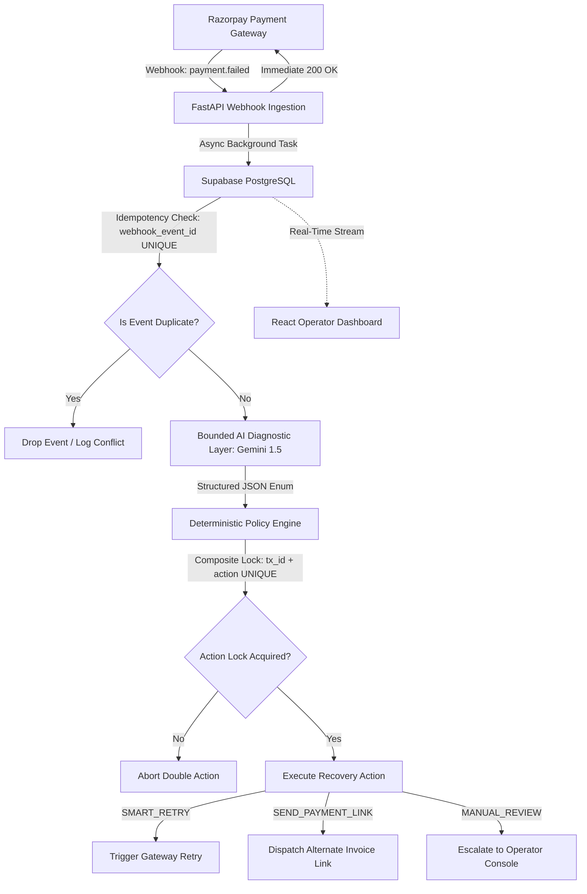

#  SentinelPay: AI-Driven Revenue Recovery Layer
> Built for the Razorpay AI Buildathon — **Track 3: AI Revenue Recovery**

SentinelPay is an enterprise-grade payment failure recovery engine. It intercepts payment failure webhooks, bounds an LLM (Gemini 1.5) to diagnose the root cause with strict type safety, and uses data-driven deterministic policies to safely recover failed payments or escalate to operators.

---

## System Architecture



## Core Engineering Guardrails

1. Bounded AI (Hallucination Prevention)

The LLM has zero direct execution permissions over financial actions.

- Strict Type Safety: The LLM is constrained via Pydantic schemas to return a closed enum: [NETWORK_DROP, INSUFFICIENT_FUNDS, SUSPECTED_FRAUD, INVALID_CARD_DETAILS, REQUIRES_HUMAN].

- Safe Fallback: Any schema validation failure or unhandled exception immediately degrades to REQUIRES_HUMAN with a 0.0 confidence score, routing the event to an operator review queue rather than halting automated processing.

2. At-Most-Once Execution (Database-Level Idempotency)

- Ingestion Lock: webhook_event_id VARCHAR(255) UNIQUE blocks duplicate webhooks from retried network delivery.

- Execution Lock: Composite unique constraint CONSTRAINT unique_recovery_action UNIQUE (transaction_id, action_taken) physically guarantees that a recovery action (e.g., SMART_RETRY) cannot run more than once for the same transaction/action combination.

## Database Setup & Explanation

The PostgreSQL database (Supabase) enforces transactional consistency. Run this SQL in your Supabase SQL Editor:

```sql
-- 1. Original payment intents
CREATE TABLE transactions (
    id UUID PRIMARY KEY DEFAULT gen_random_uuid(),
    merchant_reference VARCHAR(255) UNIQUE NOT NULL,
    amount DECIMAL(10, 2) NOT NULL CHECK (amount > 0),
    currency VARCHAR(3) DEFAULT 'INR',
    status VARCHAR(50) DEFAULT 'FAILED',
    created_at TIMESTAMPTZ DEFAULT NOW(),
    updated_at TIMESTAMPTZ DEFAULT NOW()
);

-- 2. Webhook ledger with ingestion idempotency
CREATE TABLE failed_events (
    id UUID PRIMARY KEY DEFAULT gen_random_uuid(),
    webhook_event_id VARCHAR(255) UNIQUE NOT NULL, 
    transaction_id UUID REFERENCES transactions(id) ON DELETE CASCADE,
    error_code VARCHAR(100) NOT NULL,
    raw_payload JSONB NOT NULL,
    processing_status VARCHAR(50) DEFAULT 'PENDING', 
    created_at TIMESTAMPTZ DEFAULT NOW()
);

-- 3. Execution lock preventing double-charging
CREATE TABLE recovery_attempts (
    id UUID PRIMARY KEY DEFAULT gen_random_uuid(),
    transaction_id UUID REFERENCES transactions(id) NOT NULL,
    failed_event_id UUID REFERENCES failed_events(id) NOT NULL,
    ai_diagnosis_class VARCHAR(50) NOT NULL,
    ai_confidence DECIMAL(3, 2) NOT NULL CHECK (ai_confidence BETWEEN 0 AND 1),
    action_taken VARCHAR(50) NOT NULL, 
    execution_status VARCHAR(50) DEFAULT 'EXECUTING',
    created_at TIMESTAMPTZ DEFAULT NOW(),
    CONSTRAINT unique_recovery_action UNIQUE (transaction_id, action_taken)
);

-- Mock transaction for testing
INSERT INTO transactions (id, merchant_reference, amount, currency, status)
VALUES ('550e8400-e29b-41d4-a716-446655440000', 'ORDER_TEST_123', 999.00, 'INR', 'FAILED')
ON CONFLICT DO NOTHING;
```

## Run Commands & Verification

1. Start the Backend API

```bash
cd backend
.\venv\Scripts\activate   # Windows
# source venv/bin/activate # Mac/Linux
uvicorn main:app --reload
```

2. Start the Operator Console

```bash
cd frontend
npm run dev
```

Open http://localhost:5173/ in your browser.

3. Run the Chaos & Verification Script

Simulate a payment failure and verify the idempotency lock:

```bash
cd backend
.\venv\Scripts\activate
python test_webhook.py
```
